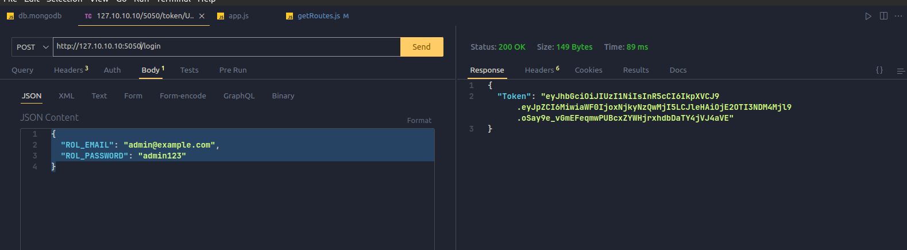
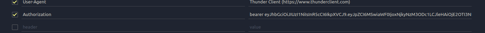

# Aplicación de Manejo de Citas Médicas

Este proyecto es un sistema de manejo de citas medicas que permite a los usuarios gestionar citas, usuarios y medicos. El sistema implementa autenticación basada en roles para acceder a los diferentes endpoints y también incluye un sistema de límite de peticiones para garantizar la seguridad y el uso eficiente de los recursos.

### Diagrama


### INFORMACION DEL PROYECTO

Esta documentación describe una aplicación de manejo de citas medicas construida utilizando Node.js, Express.js y MongoDB como base de datos. La aplicación cuenta con un sistema de autenticación basado en roles y utiliza las librerías `dotenv`, `express-session`, `jose`, `MongoDB`, `nodemon`, `express-rate-limit`, `passport`, `passport-http-bearer`.

## Requisitos previos

- Node js instalado en tu maquina (Recomendada v18.16.0)
- MongoDB instalado y configurado con las credenciales necesarias para conectarse a la base de datos.

## Instalación

**Repositorio a clonar:**

Clona este repositorio o descarga los archivos en tu máquina local.

- `https://github.com/C-jimenez21/mongoCitas`

**Instalación de dependencias:**

una vez clonado se procede a ejecutar el siguiente comando en la terminal:

```
npm install
```

## Instrucciones de uso

- Una vez instalado el proyecto se debe configurar las variables de entorno para ello crea el archivo **.env**, lo siguiente es la estructura que debe usar, también está en .env.example

```
MY_SERVER={"hostname":"uri-servidor", "port":"puerto de escucha"}
ATLAS_USER="Usuario de mongo"
ATLAS_PASSWORD="contraseña de mongo"
ATLAS_DATABASE="nombre de la base de datos de mongo (DB_CITAS_V1)"
```

**Instalación de la base de datos:**

Para instalar la base de datos y configurar las tablas necesarias, sigue estos pasos:

1. Asegúrate de tener MongoDB instalado en tu sistema y que estas conectado.
2. Abre la carpeta `scripts`y el archivo `db.mongodb`
3. A continuación selecciona todo el contenido y ejecutalo.

Una vez realizado todo el proceso tendrás la base datos `DB_CITAS_V1` con sus respectivas tablas y datos en cada una de ellas para ejecutar las peticiones

**Arranque del programa:**

- iniciar nodemon que esta señalando a app.js : 

  ```
  npm run dev
  ```

  El servidor debería iniciarse y estar listo para recibir solicitudes en la dirección `http://127.10.10.10:5050/` (puedes cambiar el puerto en el archivo `.env` si lo deseas).

- Thunder Client (extensión de Visual Studio Code) mostrará la respuesta de la solicitud en el panel de resultados. Aquí podrás ver el código de estado, los encabezados y el cuerpo de la respuesta. (agrega la solicitud HTTP para hacer las consultas, la URL se muestra despues de ejecutar nodemon en la consola asi: `Servidor activo en http://127.10.10.10:5050`


Una vez que observamos que el servidor esta activo procedemos a acceder a los router, sin embargo debemos generar el token antes por lo que procedemos:

#### **Ir el metodo POST **

Se debe generar el token según el rol al que queramos usar, dependiendo del nivel de autoridad prodremos acceder a ciertos routers.

```bash
http://127.10.10.10:5050/login
```

En la aplicacion se definieron 3 roles

* Paciente: el cual tiene acceso a las colecciones que tienen que ver con Citas y Pacientes

  ```json
  {
    "ROL_EMAIL": "paciente1@example.com",
    "ROL_PASSWORD": "paciente123"
  }
  ```

* Medico: el cual tiene acceso a las colecciones que tienen que ver con Medicos y Citas

  ```json
  {
    "ROL_EMAIL": "medico1@example.com",
    "ROL_PASSWORD": "medico123"
  }
  ```

* Admin: el cual tiene acceso a todas las colecciones.

  ```json
  {
    "ROL_EMAIL": "admin@example.com",
    "ROL_PASSWORD": "admin123"
  }
  ```

  Esta informacion debe ir en el body de nuestra peticion dado que va a verificar en la base de datos si este usuario se encuentra registrado.

  

Si todo sale bien, esto nos dara una serie de caracteres, estos conforman nuestro token

Procedemos a copiar el token y a colocarlo en la parte de headers mas concretamente como "Authorization" y debemos escribir bearer antes de pegar el token, se deberia ver mas o menos asi:



Posteriormente nos dirigimos al endpoint al cual le queramos realizar una peticion y si el rol tiene permisos sobre el endpoint, accederá de lo contrario te arrojara que no estas autorizado para acceder a este recurso.

Cabe recalcar que el token cuenta con un tiempo de duración de 5 min despues de esto expirara y tendras que generar otro

## Endpoints y Métodos

A continuación, se describen los endpoints disponibles en la aplicación junto con sus respectivos métodos HTTP y formatos de datos requeridos.

------

##### Obtener todos los pacientes alfabéticamente

**GET**

```bash
http://127.10.10.10:5050/apiv1/Usuario
```


##### Obtener todas las citas alfabéticamente

**GET**

```
http://127.10.10.10:5050/apiv1/Cita
```


##### Obtener todos los médicos de una especialidad específica (por ejemplo, **'Cardiología'**):

**GET**

* `http://127.10.10.10:5050/apiv1/Medico/:Especialidad`

Posibles especialidades : Cardiología, Ginecología, Obstetricia, Cirugía General, Dermatología.

```
http://127.10.10.10:5050/apiv1/Medico/Cardiología
http://127.10.10.10:5050/apiv1/Medico/Ginecología
http://127.10.10.10:5050/apiv1/Medico/Obstetricia
http://127.10.10.10:5050/apiv1/Medico/Cirugía General
http://127.10.10.10:5050/apiv1/Medico/Dermatología
```

Es muy importante que la consulta lleve el nombre correcto de la especialidad, de lo contrario no accesara.


##### Encontrar la próxima cita para un paciente específico (por ejemplo, el paciente con **usu_id 1**):

**GET**

* `http://127.10.10.10:5050/apiv1/Cita/NextCita/:id_paciente`

```
http://127.10.10.10:5050/apiv1/Cita/NextCita/2
```


##### Encontrar todos los pacientes que tienen citas con un médico específico (por ejemplo, el médico con **med_nroMatriculaProsional 1**)

**GET**

* `http://127.10.10.10:5050/apiv1/Cita/specificCitaByDoctor/:id_doctor`

```
http://127.10.10.10:5050/apiv1/Cita/specificCitaByDoctor/1
```


##### Obtener las consultorías para un paciente específico (por ejemplo, paciente **con usu_id 1**)

**GET**

* `http://127.10.10.10:5050/apiv1/Cita/Consultoria/:id_paciente`

```
http://127.10.10.10:5050/apiv1/Cita/Consultoria/4
```


##### Encontrar todas las citas para un día específico (por ejemplo, **'2023-07-12'**)

**GET**

* `http://127.10.10.10:5050/apiv1/Cita/specificCitaByDay/:fecha`
* La fecha debe ser en ese formato especifico "yyyy-mm-dd"

```
http://127.10.10.10:5050/apiv1/Cita/specificCitaByDay/2023-08-24
```


##### Obtener los médicos y sus consultorios

**GET**

```
http://127.10.10.10:5050/apiv1/Medico/Consultorios
```


##### Contar el número de citas que un médico tiene en un día específico (por ejemplo, el médico con **med_nroMatriculaProsional 1 en '2023-07-12'**)

* Se debe enviar en el body de la peticion, la fecha y el id del medico

**GET**

```
http://127.10.10.10:5050/apiv1/Cita/Citas-por-dia-medico
```

```
{
	"FECHA_CITA": "2023-08-24",
	"ID_MEDICO": "5"
}
```


##### Obtener los consultorio donde se aplicó las citas de un paciente

**GET**

* `http://127.10.10.10:5050/apiv1/Cita/Consultorios-paciente/:id_paciente`

```
http://127.10.10.10:5050/apiv1/Cita/Consultorios-paciente/2
```


##### Obtener todas las citas realizadas por los pacientes de un genero si su estado de la cita fue atendidad

**GET**

* `http://127.10.10.10:5050/apiv1/Cita/CitasCompletadasPorGenero/:genero`

Solo acepta dos generos : Femenino, Masculino.

```
http://127.10.10.10:5050/apiv1/Cita/CitasCompletadasPorGenero/Femenino
http://127.10.10.10:5050/apiv1/Cita/CitasCompletadasPorGenero/Masculino
```

Es muy importante que la consulta lleve el nombre correcto del genero, de lo contrario no accesara.


##### Obtener todas las citas realizadas por los pacientes de un genero si su estado de la cita fue atendidad

**GET**

* `http://127.10.10.10:5050/apiv1/Cita/CitasCanceladasPorMes/:mes`

En el mes se debe pasar el nombre del mes

```
http://127.10.10.10:5050/apiv1/Cita/CitasCanceladasPorMes/agosto
http://127.10.10.10:5050/apiv1/Cita/CitasCanceladasPorMes/septiembre
http://127.10.10.10:5050/apiv1/Cita/CitasCanceladasPorMes/octubre
```

Es muy importante que la consulta lleve el nombre correcto del genero, de lo contrario no accesara.


## Contacto

Si tienes alguna pregunta o comentario sobre esta aplicación, no dudes en ponerte en contacto con nosotros a través de [cristianjj21@gmail.com](mailto:cristianjj21@gmail.com). ¡Esperamos que disfrutes usando nuestra aplicación de agendamiento de citas odontológicas!